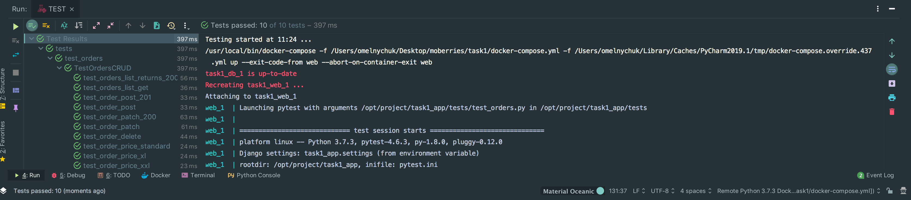

# Simple Pizza Store as an example of DRF usage
This is example of DRF based API for the simple Pizza Store.

Disclaimer: I'm a greedy store owner :). So there is a possibility to recalculate order's total price if price for pizzas in the order was changed. This works only for orders that have not being paid or shipped already.
## How to run:
In the root of cloned repo run `docker-compose build`

And then run `docker-compose up`

Go to `http://0.0.0.0: 8000`

There is Swagger UI for the API schema. 
If you prefer classic DRF view go to `http://0.0.0.0: 8000/api/`

You should create Flavour(s) first to create a pizza. You should create Customer and Pizza(s) first to be able to create orders.

## TESTS:

There are only basic tests for the "orders" endpoint. My original plan was to create much more other tests, but I'm running out of time.
I've used **pytest** as a test runner and **factory-boy** for Model Factories.

